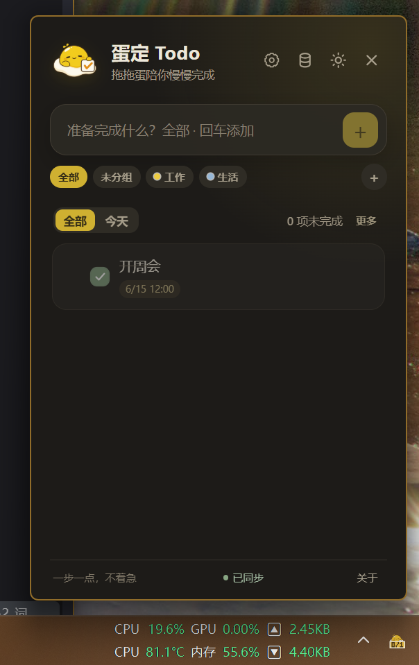

# EggDone（蛋定 Todo）

E7/L3b增量（2026-09-12）：L3a已本地提交（桌面2342edb、鸿蒙eba3c9e）。本轮接入双端关联文件同步、条件写入、实体优先、旧回执保护、独立探测和待同步摘要，见[L3b实现与验证](docs/TASK_NOTE_LINK_SYNC_SESSION.md)、[后续阶段](docs/TASK_NOTE_LINK_ROADMAP.md)。尚无关联按钮；下一步L3c备份恢复，再做L3d真实跨端验收和L4界面。当前增量未提交，不升版或推送。数据库schema不变，既有E6完整人工验收继续保留，下文为历史阶段记录。

E6c未发布（2026-09-12）：智能列表支持固定最多两个常用筛选，并在任务区直接切换；取消固定不清除当前筛选，重启保留，读写失败可重试。双端均有业务改动，自动化与构建通过，用户验收待确认，见[实现与操作步骤](docs/PINNED_SMART_VIEWS.md)。按用户要求本地提交后继续E6d，不推送或升版；下文为历史阶段记录，E6b1～E6b3人工验收仍保留。

E6b3未发布（2026-09-12）：快捷键区分保存的启用意愿和实际注册结果；开机启动查询失败显示未知，设置打开及回到窗口时只读刷新，注册失败提供重试。[实现与验收](docs/SYSTEM_CAPABILITY_STATUS.md)。本轮按用户要求生成双端handoff并本地提交，人工验收待确认；不推送、升版或开始E6c。下文“未提交”等为历史阶段记录，提交记录以最新handoff为准。

E6b2未发布：主题、语言、视图/筛选和专注默认值迁移到本机原生存储，旧WebView值只在无原生记录时迁移；多窗口按单项合并。两端实现及自动化通过，用户验收待确认，[验收步骤](docs/PREFERENCE_PERSISTENCE.md)。未提交、升版或发布；下文为此前阶段记录。

E6b1未发布修复：通用偏好读取异常不再阻断主页面/专注页启动，写入失败有明确提示；主题、语言、默认视图和专注默认时长保留原确认值。两端均有业务改动，[验证与操作步骤](docs/PREFERENCE_FAILURE_FIX.md)。原生通用偏好迁移等剩余项未做，本轮未提交。

E6a审计完成：E5c已验收提交（桌面a29b269、鸿蒙a7c8341）。本轮只补双端偏好清单、失败复现及回归测试，没有修改界面或业务逻辑，无需安装；[审计发现与下一步修复](docs/PREFERENCES_AUDIT.md)包含桌面通用偏好原生迁移、鸿蒙静默保存失败等待办。下文“待验收/未提交”为历史记录，E6a增量尚未提交。

未发布增量E5c：两端保留任务/便签切换时的筛选和列表位置；桌面搜索词及搜索栏按类型分别保留。鸿蒙统一保存后离开，设置/分组返回保留编辑器。构建、自动化及有限运行通过，用户验收待确认，见[页面上下文与操作步骤](docs/NAVIGATION_CONTEXT.md)。E5b已验收提交（桌面fa4e4ae、鸿蒙d74387d），下文为此前阶段记录；E5c未提交或发布。

体验阶段更新（2026-09-11）：用户确认E5a真机验收通过，此前“待确认”保留为过程记录。本轮E5b在鸿蒙接入任务短时撤销，桌面业务代码不变，仅做撤销/重复规则兼容回归和同步文档；操作及跨端验收见[任务短时撤销](docs/TASK_DELETE_UNDO.md)。

E4验收收口（2026-09-11）：用户确认任务行与便签操作，以及后续鸿蒙平板布局/入口去重测试通过，授权本地提交并继续E5a便签保存与离开保护。下文增量说明保留过程记录，不将本次确认扩大为完整设备/语言/字体/故障矩阵全部验收；未推送、升版或发布。

未发布增量E5a：两端便签保存失败后保留待写正文，可点“重试”；连续保存串行执行，关闭或切换先等待保存，失败不丢弃编辑内容。新草稿创建后的更新失败复用原UUID，不重复创建。自动化及构建通过，真机及完整验收待确认；不包含强杀恢复或任务撤销，见[保存行为与验收步骤](docs/NOTE_SAVE_LIFECYCLE.md)。E4已本地提交：桌面`9c3041d`、鸿蒙`4adb980`；本轮E5a按用户要求本地提交收口，记录见最新handoff，未推送。

未发布增量E4：两端任务长标题/元信息换行，完成与更多顶部对齐；桌面更多不依赖悬停。桌面便签将置顶、换色、删除收至更多，右键为补充；鸿蒙便签展开操作后点击正文仍可打开。用户确认E4验收通过。本轮补充鸿蒙平板便签侧栏“返回任务”入口，自动化和构建通过，补充修复待平板确认，见[操作与验收步骤](docs/CONTENT_LAYOUT.md)。未升版、未发布。

未发布增量E3：便签卡片/编辑、任务编辑提交按钮接入共用普通/主操作/危险/禁用样式；改进字号、换行、点击尺寸及加载反馈。鸿蒙保持胶囊按钮，便签展开操作不再受固定卡片高度裁切；桌面修正深色footer样式覆盖。用户确认测试通过并已本地提交，完整设备组合未逐项记录，见[按钮与可读性](docs/ACTION_CONTROLS.md)。未升版、未发布。

未发布增量E2b：打开便签 → 管理附件，可查看“上传失败/下载失败”“仅缩略图”“原文件待下载”“本机可用”等状态及简短处理建议；失败时明确重新上传或重新下载，并避免连续点击重复重试。缺少远端缩略图元数据的图片改为重试原文件。两端共用状态用例，自动化及构建通过，用户确认本轮验收通过，完整设备/异常网络组合未逐项记录，见[附件状态与验收步骤](docs/SYNC_STATUS_PRESENTATION.md#e2b-设备验收入口)。未升版或发布。

未发布修复：任务取消自定义重复后，不再显示已解除关联的“已停止/已耗尽”历史标签，与鸿蒙端保持一致；普通重复不再混入旧自定义规则摘要。仍关联重复系列的历史状态继续展示，规则停止记录及同步保护不变。复看“测试”任务时，无需删除或重新创建任务。

未发布增量E2a：与鸿蒙统一首页同步摘要；关闭同步显示“仅本机”，仍有修改或附件待上传时不误报“已同步”。同步设置区分简短说明和可换行的诊断详情，并注明原图/文件按需下载。自动化及构建通过，本轮原生/真实网络验收待确认，见[状态表达与测试步骤](docs/SYNC_STATUS_PRESENTATION.md)。

当前开发候选版：**1.0.10**。本次新增主窗口尺寸调整、内容缩放和本机偏好记忆；原生窗口及跨显示器验收尚待确认。此前 1.0.8 的双端开发已获用户反馈验收通过，历史证据保持原版本标识。变化、历史验收记录和正式发布核对见 [NS7 候选版记录](docs/NS7_REGRESSION_AND_RELEASE.md)，不代表已经发布。

历次版本变化见 [更新日志](CHANGELOG.md)。后续每次提升版本号同步维护该文档。

未发布改动：主面板支持拖动边缘和四角调整大小；设置中的“外观与窗口”提供小巧、舒适、大窗口预设及 100%–150% 内容缩放。支持 Ctrl/Cmd + 加号、减号、0 调整或恢复内容缩放，尺寸和比例写入本机数据库，重启时优先恢复，兼容迁移旧版浏览器存储；关闭主面板或退出进程时补存实际尺寸，不参与 S3 同步。详细操作与验收边界见 [窗口可读性说明](docs/WINDOW_READABILITY.md)。

快速收集：设置中可开启“快速便签快捷键”，也可通过 `--capture` 命令行接收文字/链接；确认后才保存任务或便签，不自动读取剪贴板。用法和待验收项见 [快速收集契约](docs/QUICK_CAPTURE_CONTRACT.md)。

快捷键记忆修复（未发布）：主面板和快速便签的快捷键组合、启用状态均保存到本机数据库，启动时兼容迁移旧版 localStorage 设置，不参与 S3 同步。启动注册失败时保留启用选择并单独提示错误，不再显示为被关闭；修改或保存失败时尝试恢复原有注册。验证时请从托盘菜单退出后重启，分别检查启用、停用和更换组合；系统快捷键占用及原生重启仍需实机验收。



EggDone 是一个轻量级、跨平台、托盘常驻的 Todo 桌面应用。应用启动后不显示普通主窗口；点击系统托盘或菜单栏图标，会在图标附近打开 Todo 面板。面板失去焦点后自动隐藏。

项目中的「拖拖蛋」是原创吉祥物：慵懒蛋黄角色配合任务勾选牌。

## 鸿蒙移动版

双端后续优化见[实现方案](docs/EXPERIENCE_EVOLUTION_IMPLEMENTATION_PLAN.md)与[roadmap](docs/EXPERIENCE_EVOLUTION_ROADMAP.md)。E1a鸿蒙统一任务/重复草稿已提交，E1b规则表单与计划预览已开发、用户已确认测试通过；桌面本轮仅同步文档，不改变数据协议或编辑行为。之后分阶段处理双端体验收敛、任务与便签关联、恢复与统一搜索。

EggDone 同时提供**纯血鸿蒙（HarmonyOS NEXT）**移动版本，支持手机和平板，数据可与桌面端通过 S3 / MinIO 同步互通。


- **华为应用市场**：[点击下载](https://appgallery.huawei.com/app/detail?id=com.eggdone.todo&channelId=SHARE&source=appshare)

## MVP 功能

- 托盘常驻，启动时隐藏面板
- 左键点击托盘图标打开或隐藏面板（Linux 通过 StatusNotifierItem 协议的 Activate 实现）
- 托盘右键菜单：打开/隐藏、新增任务、今天任务、关于、退出
- 快速新增、行内编辑、完成和取消完成 Todo
- 可为任务添加简短纯文本备注
- 快速新增可识别“今天”“明天”“周五”“明天 10:00”和已有分组 `#工作` 等轻量语法
- 按标题即时搜索，可隐藏已完成任务并置顶重要任务
- 支持单层分组筛选、新建、重命名、预设色、排序、删除、任务移动和拖动到分组
- 可为任务设置具体到期时间，支持今天、明天、下周、自定义日期、常用时刻和清除
- 可为到期任务设置系统提醒：不提醒、当天 9:00、提前一天 9:00、指定时间
- Windows 托盘进程运行时，系统提醒提供“完成”“稍后 10 分钟”和“今天晚些时候”；完成不主动弹出面板，正文仍打开任务。其他平台保留普通通知，能力和验收边界见 [通知完成契约](docs/REMINDER_COMPLETION_CONTRACT.md)。
- 支持每天、每周、每月和工作日重复任务，完成后按原时刻生成下一次实例
- 重复任务编辑标题、备注、到期时间和分组时可选择“仅此任务”或“后续任务”
- 重复任务可在删除时选择“删除本次”或“删除整个重复”
- 可在任务菜单中将已有提醒推迟到“稍后 10 分钟”或“今天晚些时候”
- 支持“全部 / 今天”视图切换，今天视图包含今日到期和逾期未完成任务
- “更多”中提供逾期、未来 7 天、无日期、重要和最近完成智能列表，支持分组和搜索组合、本机选择记忆；规则与验证边界见 [智能列表契约](docs/SMART_VIEWS_CONTRACT.md)。
- 可在设置中选择启动默认视图：记住上次、全部或今天
- 托盘提示显示未完成数量和今天/逾期任务数量
- 托盘右键菜单可预览最多 3 条今天/逾期未完成任务
- 拖动排序、清除已完成、软删除及 5 秒撤销
- 支持简单键盘导航：上下选择任务、空格完成、Enter 编辑
- 支持批量选择任务后完成、移动分组和删除
- 支持归档已完成任务，减少日常列表长度且保留同步/导出记录
- 支持纯文本便签的新建、自动保存、搜索、置顶、换色、删除和恢复
- 便签可添加图片和普通文件，支持预览、打开、保存、分享、排序和按需下载
- 包含分组、任务和便签的 JSON 导入导出、UUID 合并和 SQLite 手动备份
- 可配置 AWS S3、MinIO 和其他 S3 兼容存储
- Access Key 和 Secret Key 保存到系统凭据库
- 支持分别下载、合并并上传任务、便签和附件，同步写入使用 ETag 冲突保护
- 主同步已接入独立重复规则发现；切换同步配置后拒绝旧回包确认，部分失败保留已合并数据并刷新界面。兼容策略和验收边界见 [规则同步契约](docs/RECURRENCE_SYNC_SESSION_CONTRACT.md)。
- 前台同步探测现已包含独立规则变更，沿用约 60 秒轮询；失败不会消耗待处理变化，切换配置后丢弃旧探测结果。不承诺后台实时推送。
- 普通任务完成已接入独立规则事务，取消完成不回退规则；下一项按 UUID 合并，批量部分失败保留已提交结果，见 [普通操作契约](docs/RECURRENCE_TASK_ACTION_CONTRACT.md)。
- 开发中：自定义规则当前项删除视为跳过一次，删除整个系列同时停止规则；撤销仅恢复任务，不恢复已停止的规则。单项/选中项删除已接通。
- 候选版自定义重复已开放：已保存任务的日期设置 → 自定义重复，可设置日/周/月间隔、星期/月内日、结束条件和固定时区；列表摘要可点开编辑/停止。保存会清除旧提醒，修改周期保留历史；原生和跨端验收待完成，见 [界面与验收契约](docs/RECURRENCE_EDITOR_UI_CONTRACT.md)。
- JSON/完整备份现使用数据 v2，纳入自定义重复规则和防重复生成的实例回执；支持旧 v1 恢复，但旧客户端不能导入 v2。恢复保留较新进度和停止状态，与同步互斥，见 [规则备份契约](docs/RECURRENCE_BACKUP_CONTRACT.md)。
- 启动和窗口回到前台时自动同步，前台每 60 秒检查 ETag，本地修改后 4 秒防抖同步
- 可配置全局快捷键，默认 `Ctrl + Shift + Space`
- 可选开机自动运行，并静默进入托盘
- 显示未完成任务数量和空状态
- 亮色和暗色主题切换，首次启动跟随系统并记住选择
- 界面支持简体中文、English 和跟随系统语言，切换语言不重载当前编辑内容
- 面板无边框、置顶、跳过任务栏，失焦自动隐藏
- 面板按托盘所在显示器定位，并限制在显示器工作区内
- 区分托盘点击与普通失焦，避免弹层和原生下拉操作误隐藏
- SQLite 本地持久化
- 数据库顺序迁移，旧版数据可自动升级
- 单实例运行，重复启动时唤醒已有面板
- Windows 优先，同时保留 macOS 和 Linux 结构

## 技术栈

- Tauri 2
- Svelte 5 + SvelteKit + TypeScript
- Rust + rusqlite（bundled SQLite）
- pnpm

## 开发环境

请先安装：

- Node.js 20 或更高版本
- pnpm 10 或更高版本
- Rust stable 工具链
- 对应平台的 Tauri 系统依赖

Windows 需要 WebView2。Windows 10/11 通常已安装。

## 开发命令

```bash
pnpm install
pnpm tauri dev
```

应用启动后默认隐藏，请在系统托盘中找到 EggDone 图标并左键点击。

常用检查命令：

```bash
pnpm check
pnpm i18n:check
pnpm build
pnpm test
cd src-tauri
cargo check
cargo test
cargo fmt -- --check
```

## 构建

```bash
pnpm tauri build
```

构建产物位于 `src-tauri/target/release/bundle/`。不同平台会生成对应的安装包格式。

Windows NSIS 安装包：

```bash
pnpm build:windows
```

输出目录为 `src-tauri/target/release/bundle/nsis/`。安装器使用当前用户模式，无需管理员权限；正式公开发布前仍需配置 Windows 代码签名。

仓库提供 `scripts/verify-windows-installer.ps1`，用于使用两个相邻版本的安装包自动验证安装、覆盖升级、降级拦截和卸载。具体命令见 Windows 发布流程。

发布前完整检查：

```bash
pnpm release:check
```

`pnpm i18n:check` 会检查中英文字典键、占位符以及 Svelte 模板中的用户可见中文硬编码。超长伪本地化文案由测试生成，不会打包为可选语言。

手动回归和 Windows 发布流程见：

- [docs/MANUAL_REGRESSION.md](docs/MANUAL_REGRESSION.md)
- [docs/RELEASING_WINDOWS.md](docs/RELEASING_WINDOWS.md)

## 数据存储

应用首次启动时会在平台应用数据目录创建 `eggdone.sqlite3`。数据库包含 `todos` 表：

| 字段 | 说明 |
| --- | --- |
| `id` | 自增主键 |
| `uuid` | 跨设备唯一标识 |
| `title` | 任务内容 |
| `note` | 简短纯文本备注（可空） |
| `group_uuid` | 所属分组 UUID（可空，空表示未分组） |
| `completed` | 完成状态 |
| `pinned` | 是否置顶 |
| `sort_order` | 任务排序值 |
| `created_at` | UTC 创建时间（毫秒时间戳） |
| `updated_at` | UTC 更新时间（毫秒时间戳） |
| `updated_by` | 最后修改该任务的设备 UUID |
| `completed_at` | UTC 完成时间（毫秒时间戳，可空） |
| `deleted_at` | UTC 软删除时间（毫秒时间戳，可空） |
| `archived_at` | UTC 归档时间（毫秒时间戳，可空） |
| `due_date` | 纯日期到期日，本地日历语义，格式 `YYYY-MM-DD`（可空） |
| `due_at` | 具体到期时间，UTC 毫秒时间戳（可空） |
| `reminder_at` | 提醒时间，UTC 毫秒时间戳（可空） |
| `repeat_rule` | 重复规则：`daily`、`weekly`、`monthly`、`weekdays`（可空） |
| `repeat_next_due_date` | 完成当前实例后生成的下一次日期，格式 `YYYY-MM-DD`（可空） |
| `repeat_series_uuid` | 重复系列 UUID，用于整组删除和跨设备同步（可空） |

`groups` 表保存单层分组，`notes` 表保存便签正文、颜色、置顶状态和删除墓碑。`schema_migrations` 表记录已执行的数据库版本，`app_metadata` 保存本机 `device_id`，`sync_settings` 只保存 Endpoint、Region、Bucket、Object Key 等非敏感配置，`reminder_deliveries` 记录本机已触发提醒以避免重复通知。Access Key 和 Secret Key 保存到操作系统凭据库，不写入 SQLite。开发时可以删除数据库以重置数据，具体根目录由 Tauri 的 `app_data_dir` 按平台决定。

项目已包含版本化同步文档和本地合并核心：按 Todo UUID 合并，优先采用较新的 `updated_at`；时间相同时优先保留删除记录，再通过 `updated_by` 稳定决胜。两台设备离线同时完成同一重复任务时，同一重复系列、同一到期日只保留一个未完成的下一实例，重复生成的实例会被软删除。设置页可配置 AWS S3 或自定义 S3 Endpoint，支持 MinIO 常用的 Path Style 和 HTTP。HTTP 必须显式确认明文传输风险。

“测试连接”会向配置的 Bucket 和 Object Key 发起签名请求，验证 Endpoint、凭据和访问权限；返回 404 时会提示同步文件尚未创建，此时仍需确认 Bucket 已提前创建。

“立即同步”依次处理任务、便签、附件二进制和附件元数据。默认任务使用 `todos.json`，便签和附件路径从任务 Object Key 自动推导；自定义任务路径时，设置页会显示对应的只读路径。各数据域分别按 UUID 合并并使用 ETag 保护，旧客户端继续操作 `todos.json` 或 `notes.json` 时不会改写附件对象。

启用同步且系统凭据可用时，应用启动或窗口重新获得焦点时会检查远端 ETag；窗口保持前台期间每 60 秒重复检查，ETag 未变化时不会下载完整同步文件。新增、编辑标题或备注、设置到期时间、完成、排序、删除和恢复任务后，会在最后一次修改的 4 秒后同步。“立即同步”始终执行完整下载、合并和上传。网络类错误使用 1.5 秒、3 秒两次有限退避；权限、配置和持续冲突错误不会自动重试。本地 Todo 操作不等待网络结果，窗口隐藏后停止轮询，退出时也不会阻塞等待同步。

面板右上角的“数据管理”可导出包含分组、任务、便签和附件元数据的版本化 JSON、预览并合并导入文件，或创建包含附件二进制的 `.eggdone-backup` 完整备份。旧备份缺少 `notes` 或附件字段时按空集合处理；新备份使用与 S3 同步相同的冲突决胜规则，不会直接覆盖较新的本地数据。

面板右上角的“设置”可管理全局快捷键、启动默认视图、系统开机启动和 S3 / MinIO 同步连接。删除系统凭据时会同时禁用同步。快捷键冲突时会保留之前的有效配置并显示错误。

## 目录结构

```text
EggDone/
├─ src/
│  ├─ lib/
│  │  ├─ api/todoApi.ts          # Tauri command 调用
│  │  ├─ api/syncApi.ts          # 同步配置和连接测试调用
│  │  ├─ components/             # Todo 面板和列表项
│  │  ├─ stores/todoStore.ts     # Todo 状态与操作
│  │  └─ types.ts
│  ├─ routes/+page.svelte        # SvelteKit 页面入口
│  └─ app.css
├─ src-tauri/
│  ├─ icons/                     # 图标源文件及各平台图标
│  ├─ src/
│  │  ├─ commands.rs             # 前后端命令
│  │  ├─ db.rs                   # SQLite 初始化
│  │  ├─ panel_position.rs       # 多显示器面板定位计算
│  │  ├─ s3_sync.rs              # S3 配置、系统凭据和连接测试
│  │  ├─ sync.rs                 # 同步文档、冲突决胜和 UUID 合并
│  │  ├─ tray.rs                 # 托盘菜单、事件和窗口定位
│  │  ├─ lib.rs                  # Tauri 应用装配
│  │  └─ main.rs
│  └─ tauri.conf.json
├─ docs/                         # 手动回归和发布流程
├─ scripts/                      # Windows 安装包自动验证脚本
├─ LICENSE
└─ AGENTS.md
```

## 当前限制

- 托盘附近定位使用平台提供的图标坐标；不可用时回退到主屏幕右下角。
- Windows 混合 DPI 多显示器仍需在 125%、150% 和 200% 缩放下进行实机验收。
- 到期时间支持日期和分钟级时刻；旧的日期级任务首次编辑时默认使用 18:00。系统提醒已支持基础发送、指定提醒时间、面板内稍后提醒，以及 Windows 通知点击定位和通知按钮。macOS / Linux 暂使用普通系统通知回退，不保证通知按钮能力。重复任务会保留原到期时刻生成下一实例，编辑时可选择“仅此任务”或“后续任务”。
- 快捷新增语法只做确定性关键词解析，不支持复杂自然语言；`#分组` 只匹配已有分组，不会自动创建分组；无法识别时会按完整标题创建任务。
- 批量删除重复任务时按单条实例删除，不会删除整个重复系列。
- 同步状态仅保存在当前运行会话中，尚未持久化最后成功时间。

下一阶段实现方案和执行顺序见 [docs/NEXT_STAGE_IMPLEMENTATION_PLAN.md](docs/NEXT_STAGE_IMPLEMENTATION_PLAN.md) 与 [docs/NEXT_STAGE_ROADMAP.md](docs/NEXT_STAGE_ROADMAP.md)。

历史优化记录保留在 [OPTIMIZATION_TODO.md](OPTIMIZATION_TODO.md) 和 [FUNCTION_OPTIMIZATION_TODO.md](FUNCTION_OPTIMIZATION_TODO.md)，不再作为当前开发入口。
