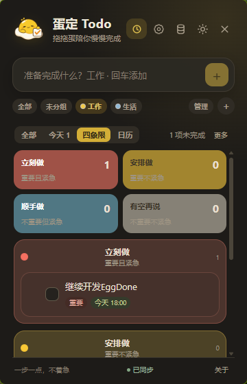
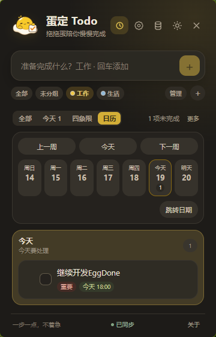

# 蛋定 Todo：一只住在系统托盘的慵懒蛋黄，帮你把今天的事做完

## 这是什么

蛋定 Todo（EggDone）是一个轻量级 Windows 桌面 Todo 工具。它不抢你的桌面空间，启动后安静地缩在系统托盘里，需要时点一下就弹出来，做完事点别的地方它就自己缩回去。

没有主窗口，没有任务栏图标，没有弹窗广告。就一个托盘图标 + 一个失焦即隐的面板。

它的吉祥物叫「拖拖蛋」——一颗慵懒的蛋黄，陪你勾掉每一条任务。

## 为什么用它

市面上的 Todo 工具要么太重（Notion、TickTick），要么太丑（系统便签），要么需要联网注册账号才能用。蛋定 Todo 的定位很明确：

- **即开即用**：托盘左键打开面板，输入文字回车就建任务，再点别处面板自动消失。
- **完全离线**：数据存在本地 SQLite，不需要注册账号，不需要联网。
- **可选同步**：如果你有多台电脑，可以配置 S3 / MinIO 同步，数据自己掌控。
- **轻量治愈**：蛋黄色圆角卡片风格，暗色模式自动跟随系统。

## 核心功能

### 快捷输入

在输入框里直接打字就行。支持轻量语法：

- `明天 10:00 交报告` — 自动识别日期和时间
- `周五 15:00 开会 #工作` — 自动匹配已有分组
- `!重要事项` — 开头感叹号标记为重要

解析结果会在保存前给你一个预览，不喜欢可以按原文保存。

### 到期、提醒和重复

- 支持为任务设置到期日期或具体时间
- 系统提醒通知，Windows 下支持「稍后 10 分钟」和「今天晚些时候」按钮
- 点击通知直接打开面板并定位到对应任务
- 支持每天、每周、每月、工作日重复，完成后自动生成下一次
- 重复任务编辑和删除时可选「仅此任务」或「后续整个重复」

### 四象限视图

按重要程度 × 紧急程度把任务分成四个象限。紧急由到期日自动推导，不需要手动标记。适合快速判断今天该先做什么。

### 日历 / 日程视图

按日期分桶展示：逾期、今天、明天、本周内、更晚、无到期日。顶部有一条 7 天周条，有任务的天会显示计数。适合看这一周的任务分布。

### 番茄钟 / 专注

独立悬浮窗，不随主面板一起隐藏。默认 25 分钟专注 + 5 分钟休息，支持暂停、+5 分钟、跳过和结束。可以关联一条任务，专注结束后可以一键标记完成。

觉得悬浮窗太大？可以收成一个小胶囊，只显示阶段和倒计时，拖到屏幕角落不碍事。

### 其他实用功能

- **分组**：单层分组，预设柔和颜色，支持拖动排序
- **搜索**：即时过滤，支持隐藏已完成任务
- **置顶**：重要任务固定在列表顶部
- **批量操作**：多选后批量完成、移动分组或删除
- **归档**：已完成的任务可以归档，减少列表噪音但保留记录
- **键盘导航**：上下选择、空格完成、回车编辑
- **全局快捷键**：默认 `Ctrl + Shift + Space` 一键唤出面板
- **开机启动**：可选静默启动，直接进入托盘
- **JSON 导入导出**：数据完全可迁移，不绑架用户
- **SQLite 备份**：一键创建本地快照

## 跨设备同步（可选）

如果你有两台甚至更多电脑，蛋定 Todo 支持 S3 兼容存储同步：

- 支持 AWS S3、MinIO 和其他 S3 兼容服务
- Access Key / Secret Key 存在系统凭据库，不写入数据库
- ETag 冲突保护，两台设备同时修改不会互相覆盖
- 本地修改后 4 秒自动同步，前台每 60 秒检查远端变更
- 离线时正常使用本地数据，联网后自动追平

同步是可选功能，不配置就完全离线，不会有任何网络请求。

## 技术栈

Tauri 2 + Svelte 5 + Rust + SQLite。安装包很小，内存占用很低，不依赖 Electron 那套东西。

## 下载

Windows NSIS 安装包，当前用户模式安装，不需要管理员权限。

**项目地址**：https://github.com/godsay1983/EggDone

## 适合谁

- 想要一个不占地方、随叫随到的桌面 Todo
- 不想注册账号、不想联网、不想被功能淹没
- 需要到期提醒和重复任务，但不想用重型项目管理工具
- 喜欢蛋黄色和圆角卡片的人

---

*蛋定 Todo，今天也要蛋定完成。*
